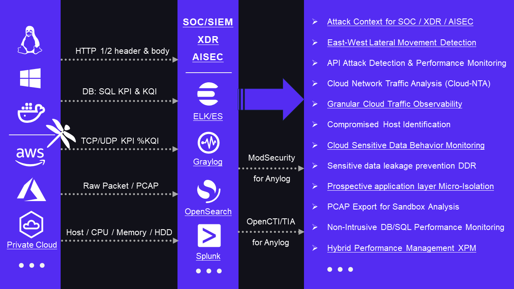

# Microflow Sentinel

**The smallest of its kind, yet its power knows no bounds.**

## 🎬Brief Introduction

- It is a cloud/native basic data capability, **a host-based**, ultra-high performance, fine-grained, multi-dimensional traffic analysis tool.
- It is designed according to **commercial product standards**, it has large-scale deployment and 24/7/365 operation capability. 
- It can provide **high-quality traffic log data and various indicators** for various security and monitoring scenarios in real time.

## 🚀 Key Features

- **Ultra-Lightweight**: Just 500KB standalone Linux tool, yet incredibly powerful.
- **Cross-Platform**: Works on Linux, Windows, ARM/X86, K8S & containers.
- **Ultra-High Performance: Fixed 110MB memory footprint, without additional CPU resources**.
- **Fine-grained Monitoring**: Real-time HTTP/API/header/body, SQL, DNS, TCP/UDP......,and system metrics.

## 💡 Benefits

1. **Deploy in Seconds**: One version fits all major Linux distros. No dependencies, no hassle.
2. **Zero Impact Observability**: Deep insights without affecting your production environment.
3. **Open data structure**: Encapsulated with JSON UDP, quickly adapted to ELK/ES, Splunk，Graylog，OpenSearch...

## 🎯 Use Cases

[More details](https://github.com/Microflow-IO/microflow.sentinel/blob/main/Where%20Microflow%20Sentinel%20Shines.md)

## 🚦 Get Started in 3 Steps

1. Download the standalone program for your platform.
2. Deploy with a single command – no configuration needed.
3. Start collecting data in JSON UDP format, compatible with ELK, Splunk, Graylog, and more.

## 🏆 Battle-Tested Reliability

- Developed since 2020, now in version 4.0
- Deployed on 1000+ IaaS hosts and 10,000+ PaaS VMs/K8S nodes

## 💰 Free and Open Source

| User Type             | Plan                                       |
| --------------------- | ------------------------------------------ |
| Individuals           | Free Forever                               |
| Education             | Free Forever                               |
| SMBs                  | Free Forever                               |
| Medium to Large Users | **Commercially licensed, but open source** |

## 🎉 Ready to Revolutionize Your Cloud Security?

[Try Microflow Sentinel for Free Today!](#)

---

*Microflow Sentinel: Bridging the critical gap in cloud infrastructure data capabilities. Join us in this transformative journey and witness the magic of our 500KB marvel!*
