  

<h1 style="font-size: 30px;">MicroFlow Nano</h1>  
<h2 style="font-size: 50px;">FAQ</h2>

  
* Contents
{:toc}

[Product Overview](https://microflow-io.github.io/docs/faq/nano-faq-project-overview.html)

[Nano and AI](https://microflow-io.github.io/docs/faq/nano-faq-ai.html)

[Safety Related](https://microflow-io.github.io/docs/faq/nano-faq-safety-related.html)

[Performance and Consumption](https://microflow-io.github.io/docs/faq/nano-faq-performance-consumption.html)

[Before deployment](https://microflow-io.github.io/docs/faq/nano-faq-before-deployment.html)

[Solution Integration](https://microflow-io.github.io/docs/faq/nano-faq-solution-integration.html)

- [🎏Project Overview](#--project-overview)
  * [What is Microflow Nano?](#what-is-microflow-nano-)
  * [What problem does Nano solve?](#what-problem-does-nano-solve-)
  * [What application scenarios can be realized by adopting Nano?](#what-application-scenarios-can-be-realized-by-adopting-nano-)
  * [Technical highlights of Nano](#technical-highlights-of-nano)
  * [What data and KPIs can Nano output?](#what-data-and-kpis-can-nano-output-)
  * [Is there an online demo](#is-there-an-online-demo)
  * [Is Nano an open-source program?](#is-nano-an-open-source-program-)
  * [Is Nano free?](#is-nano-free-)
  * [How can I obtain technical support?](#how-can-i-obtain-technical-support-)
- [🤖Nano and AI](#--nano-and-ai)
- [🚒Safety Related](#--safety-related)
  * [How to ensure that it does not affect business operations?](#how-to-ensure-that-it-does-not-affect-business-operations-)
  * [Is Nano safe](#is-nano-safe)
  * [Can the data output by Nano be encrypted?](#can-the-data-output-by-nano-be-encrypted-)
  * [Do I need to export the host traffic to the outside?](#do-i-need-to-export-the-host-traffic-to-the-outside-)
  * [Can Nano parse HTTPS?](#can-nano-parse-https-)
- [💣Performance and Consumption](#--performance-and-consumption)
  * [Processing performance and resource consumption](#processing-performance-and-resource-consumption)
  * [What should we do if the data volume of traffic logs is too large?](#what-should-we-do-if-the-data-volume-of-traffic-logs-is-too-large-)
  * [What is the difference between Nano and switch mirroring?](#what-is-the-difference-between-nano-and-switch-mirroring-)
- [🏡Before deployment](#--before-deployment)
  * [What platforms or environments can Nano be deployed in?](#what-platforms-or-environments-can-nano-be-deployed-in-)
  * [Do I need to restart or modify the host or business configuration?](#do-i-need-to-restart-or-modify-the-host-or-business-configuration-)
  * [Do I need to increase computing power resources for Nano?](#do-i-need-to-increase-computing-power-resources-for-nano-)
  * [Which servers can receive the output data of the Nano?](#which-servers-can-receive-the-output-data-of-the-nano-)
  * [What permissions are required during deployment?](#what-permissions-are-required-during-deployment-)
  * [How does Nano upload data?](#how-does-nano-upload-data-)
  * [Can I use the log collection agent to collect Nano data](#can-i-use-the-log-collection-agent-to-collect-nano-data)
  * [How is Nano managed?](#how-is-nano-managed-)
  * [Let's start a simple single host test](#let-s-start-a-simple-single-host-test)
  * [How to make rapid large-scale deployment and management？](#how-to-make-rapid-large-scale-deployment-and-management-)
  * [Can Nano parse HTTPS?](#can-nano-parse-https--1)
- [🎨Solution Integration](#--solution-integration)
  * [Which third-party products can Nano be compatible with?](#which-third-party-products-can-nano-be-compatible-with-)
  * [Which risk detection engines can be adapted to Nano's data?](#which-risk-detection-engines-can-be-adapted-to-nano-s-data-)
  * [How to integrate with AWS CloudWatch?](#how-to-integrate-with-aws-cloudwatch-)
  * [How to integrate with AZURE Monitor?](#how-to-integrate-with-azure-monitor-)
  * [How to adapt ELF/EFK?](#how-to-adapt-elf-efk-)
  * [How to adapt to Splunk?](#how-to-adapt-to-splunk-)
  * [How to adapt to Graylog?](#how-to-adapt-to-graylog-)
  * [How to adapt to AWS OpenSearch?](#how-to-adapt-to-aws-opensearch-)
  * [How to adapt Wazuh?](#how-to-adapt-wazuh-)
  * [How to adapt to IBM QRadar?](#how-to-adapt-to-ibm-qradar-)

------

# 🎏Product Overview

## What is Microflow Nano?

- Nano is a super lightweight, high-performance host-level traffic parsing tool;  it is a data tool designed based on DaaS (Data as a Service); nano is primarily used in cloud and cloud-native environments;  it can also be applied to traditional hardware environments;
- Nano can provide high-quality, fine-grained, and versatile session logs and rich metrics for server or third-party applications without affecting production or increasing computing resources.  It can enable a variety of application scenarios such as performance monitoring, traffic analysis, risk detection, and incident tracing.

## What problem does Nano solve?

- **Demand:** Fine-grained traffic logs serve as the foundational data for various tasks such as "risk detection, performance monitoring, and traffic analysis";  however, obtaining them can be challenging in the context of cloud and cloud-native architectures;
- **Puzzlement:** On the one hand, under cloud and cloud-native architectures, workloads are more flexible and computing resources are more sensitive;  on the other hand, real-time parsing of data packets and outputting fine-grained traffic logs require more resources;
- **Question:** How can we generate fine-grained traffic logs without increasing resources?
- **Solution:** Nano, with its excellent architectural design and coding capabilities, perfectly resolves the aforementioned contradictions and demands.

## What application scenarios can be realized by adopting Nano?

By integrating with various log analysis platforms, observability solutions, and risk detection SOC solutions, Nano's high-quality, fine-grained traffic log data can quickly realize a wide range of application scenarios, including important needs that have not yet been addressed or have achieved suboptimal results in cloud and cloud-native environments at this stage.

1.	**Attack Context for SOC / XDR / AISEC**
2.	**East-West Lateral Movement Detection**
3.	**API Attack Detection & Performance Monitoring**
4.	**Cloud Network Traffic Analysis (Cloud-NTA)**
5.	**Granular Cloud Traffic Observability**
6.	**Compromised Host Identification**
7.	**Cloud Sensitive Data Behavior Monitoring**
8.	**Sensitive data leakage prevention DDR**
9.	**Prospective application layer Micro-Isolation**
10.	**PCAP Export for Sandbox Analysis**
11.	**Non-Intrusive DB/SQL Performance Monitoring**
12.	**Hybrid Performance Management XPM**

## Technical highlights of Nano

- **Ultra-lightweight:** a standalone Linux tool weighing only 500KB, yet boasting incredibly powerful functionality;
- **Ultra-low resource consumption:** fixed memory usage of 110MB, capable of processing massive amounts of data in real time without requiring additional CPU resources;
- **Ultra-fine granularity:** Real-time parsing of HTTP/API/header/body, SQL, DNS, TCP/UDP...... as well as host metrics;
- **Super safe:** The deployment of Nano does not require restarting or altering the host and user services; it does not involve any kernel risks; and it does not introduce third-party runtime dependencies;
- **Cross-platform:** compatible with Linux, Windows, ARM/X86, K8S, and container environments; as well as various cloud environments.

## What data and KPIs can Nano output?

Please refer to another .md document, "**[Nano Output List](https://github.com/Microflow-IO/microflow-nano/blob/main/docs/Nano_Output_List.md)**".

## Is there an online demo

[demo](http://223.223.184.202:9000/)

login: guest

password: mfnano@2024

## Is Nano an open-source program?

Nano is not a program open to the public;  however, it can be selectively open-sourced for commercial key accounts.  Other projects of Microflow.io are open to the public.

## Is Nano free?

Nano is permanently free for individuals and small-to-medium-sized users.

For commercial key accounts, Nano will charge an appropriate cost, but it will be significantly lower than the cost of developing Nano by the users themselves.

## How can I obtain technical support?

For the free version, users can communicate through GitHub issues;  we will respond as promptly as possible;

For the commercial version, users can contact us via email (microflow.io@gmail.com). Typically, we will respond within a maximum of four hours and provide an estimated time for addressing potential program bugs.

# 🤖Nano and AI

There is no doubt that Nano's high-quality cloud and cloud native fine-grained traffic logs can greatly improve the efficiency of AI analysis and are natural partners of various AI scenarios.

**1. AISEC**

- Detect potential threats more quickly and identify abnormal behaviors and security attacks;

- Establish a comprehensive security behavior model based on traffic patterns.

**2. AISECOPS**

- Significantly shorten accident response time and automate operation safety strategy;

- Provide historical traffic correlation analysis to accurately locate the root cause of the accident.

**3. AIOPS**

- Improve the performance and stability of the cloud environment through fault prediction and resource optimization;

- Monitor the microservice invocation chain and locate performance bottlenecks and resource exceptions.

**We are also conducting tests in this area. Experiments show that in some cases, Nano data can help us reduce data governance time by 60% and improve risk and fault location accuracy by 80%.**

**By the way, we plan to release our SecOps AI Agent in October 2025**.

# 🚒Safety Related

## How to ensure that it does not affect business operations?

This question needs to be explained in three parts.

- Firstly, deployment and operation interference.  Please refer to "**Do I need to restart or change the host or business configuration?**" and "**Is Nano safe?**" 
- Secondly, resource occupation during runtime.  Please refer to "**Do I need to add new computing resources for Nano?**".
- Thirdly, how to ensure data security.  Please refer to "**Can the data output by Nano be encrypted?**" and "**Do I need to export the host traffic to the outside?**".

## Is Nano safe

As a probe program for processing fine-grained traffic log data, any concerns users may have about security are quite reasonable.  Naturally, the security of Nano has also been thoroughly considered and designed, as reflected in the following points:

- **Resource security:** The extremely low resource overhead and upper limit control algorithm are sufficient to ensure that Nano does not compete with other programs for computing resources, which is the most important design for Nano's resource security. Please refer to "Nano's Processing Performance Reference Metrics" for details;
- **Program security:** Nano is a standalone program, which significantly reduces security risks from the perspective of software supply chain and dependency environment. Additionally, we also provide an open-source version for medium to large-scale users, alleviating concerns about code risks;
- **Data Security:** Nano offers a data encryption feature using its proprietary algorithm, which users can opt to enable. In this scenario, the receiving end should utilize Logstash, as we have developed a Logstash plugin specifically for decryption purposes.

## Can the data output by Nano be encrypted?

**Method 1:** For scenarios requiring encryption, the simplest method is to use the encryption and decryption function of back-to-back LogStash; This method is commonly used for cross public network transmission.

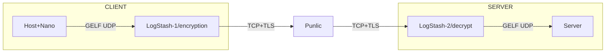

**Method 2:** Nano provides a data encryption feature option using its own algorithm, which users can choose to enable;

For the receiving end, we recommend using Logstash, for which we have developed a Logstash plugin for decryption functionality.  Additionally, Logstash supports a wide range of Output methods and objects.

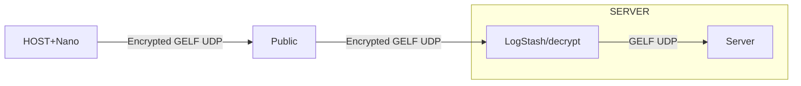

## Do I need to export the host traffic to the outside?	

NOT REQUIRED.

- Firstly, Nano has the capability to export raw packets to the external environment in real-time or offline;  however, doing so will significantly affect the performance of the environment, cloud network, and host. Therefore, we strongly advise users against doing this;
- In fact, Nano is specifically designed to extract and calculate fine-grained traffic logs required for monitoring and security scenarios within the program, with ultra-high performance and ultra-low consumption. Therefore, in most cases, users no longer need Raw Packets for packet parsing.
- Doing so not only has no significant impact on the environment, cloud network, and hosts, but also easily meets various cross-cloud and cross-domain cloud network monitoring and risk detection requirements.

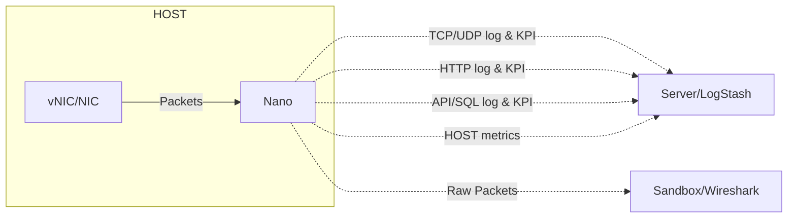

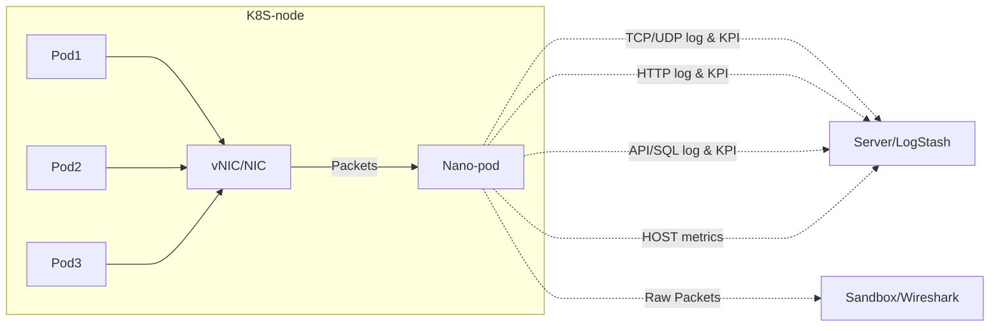

## Can Nano parse HTTPS?

- High version Nano can parse SSL/TLS plaintext without a CA certificate; But it needs to be higher than Kernel 4.14; Windows does not support;
- Low version Nano does not support parsing encrypted traffic; However, in most cases, this does not affect Nano from achieving its intended value! Because the actual deployment location of Nano in production environments is usually before loading HTTPS or after unloading HTTPS; In other words, in most cases, where Nano is deployed, HTTPS is not the primary traffic, so there is no need to worry about the encryption and decryption issues of HTTPS.

# 💣Performance & Consumption

## Processing performance and resource consumption

Under 99% of the working conditions, Nano can operate solely with the remaining computing power resources of the host; the following parameters are for reference only;

- Nano parses 1Gbps network traffic in real-time and outputs TCP/UDP quadruples and KPIs, while only consuming 5% of  vCPU and 110MB of memory;
- Nano can parse 100/200/1000 concurrent HTTP sessions in real time, outputting HTTP/REQ/RSP/Header/Body, as well as KPIs, while only consuming 3%/4%/10% of vCPU and 100MB of memory;
- In extreme cases, when CPU usage exceeds 20% of one vCPU, Nano will initiate a throttling algorithm to reduce CPU overhead and avoid affecting the operation of other programs;
- Storage requirements?  If the user does not store JSON or PCAP files locally on the host, there is no need to consider the storage overhead of the program itself.

## What should we do if the data volume of traffic logs is too large?	

First of all, since Nano outputs a very simplified traffic log, which has removed background traffic, various communication overhead, and redundant bytes, and it does not output media class loads by default, the interference of the actual output data volume of the Nano to the bandwidth can be almost ignored (please contact us for specific indicators);

Of course, if users still need to further reduce the size of the Nano output traffic, we also provide three methods: 

- **Customized types of output data:** For example, in the application performance monitoring scenario, you can only choose to parse the HTTP header without outputting the HTTP body and TCP/UDP communication pairs;
- **Real time compression:** Turn on the compression function of Nano, usually 60% is compressed, which has no obvious impact on resource consumption and processing performance;
- **Sampling of communication pair aggregation and application layer session:** reduce the number of TCP/UDP communication pairs by enlarging the TCP/UDP aggregation time; By sampling application layer sessions (HTTP, SQL, etc.), you can reduce the number of application layer sessions;
- **Truncation of the load segment body:** In most functional scenarios, a complete load segment body is not required. Therefore, users can define the size of the body themselves to reduce the size of the traffic log.

## What is the difference between Nano and switch mirroring?

The (virtual) switch mirroring method, which is commonly used in traditional architectures, is no longer applicable in cloud environments.  However, traffic analysis through virtual switch mirroring is typically used in cloud security resource pool solutions for boundary security, and is not suitable for traffic collection within clouds and cloud-native environments.

Nano is a host-level packet parsing tool that can be flexibly deployed in almost all environments. It does not require any functionality of switches and can achieve fine-grained traffic logging services without blind spots;

In addition, even in environments where it is not convenient to implant probe programs, the issue can be resolved by deploying Nano to servers or virtual machines, and then performing switch mirroring.

# 🏡Before deployment

## What platforms or environments can Nano be deployed in?

Nano is a system-level user-mode program that can be adapted to almost all mainstream operating systems, as well as various architectures or environments.  This includes but is not limited to:

- All Linux distributions;  Windows versions;
- X86 platform, ARM platform;
- K8S (image);
- Public cloud, private cloud, hybrid cloud;  virtualization, hyper-converged;  hardware server.

## Do I need to restart or modify the host or business configuration?

No need to restart the host or service, nor to alter the host or service configuration.  Users simply need to establish the relevant network and security policies based on the address and routing of the data receiver.

## Do I need to increase computing power resources for Nano?

When deploying based on the host operating system, it is not necessary.  For details, please refer to "**Processing performance and resource overhead**".

## Which servers can receive the output data of the Nano?

Since the Nano uses open JSON over GELF UDP to send, there are a wide variety of servers.

please refer to “**Server integration**”

## What permissions are required during deployment?

- The Linux version requires root privileges;
- The Windows version requires Administrator privileges.
- K8S, please use DaemonSet to deploy Nano Image as a Pod.

## How does Nano upload data?

Nano has two methods for uploading data to the server or data middleware such as LogStash.

- Nano adopts an active PUSH method to upload JSON over GELF UDP to the server;
- For servers that do not support GELF UDP, Nano can first push the data to LogStash, and then have LogStash push it to the server;
- Nano can also locally cycle and write JSON data into JSON files, which are then uploaded to a third party log collection tool, such as Filebeat, Nxlog, Fluentd, Splunk Universal Forwarder......

## Can I use the log collection agent to collect Nano data

**SURE.**

Nano can locally cycle and write JSON data into JSON files, which are then uploaded to server by a log collection tool, such as Filebeat, Nxlog, Fluentd, Splunk Universal Forwarder......

## How is Nano managed?

Nano can be managed in two ways.  First, through configuration file management.

- Users can update the local configuration file of Nano by updating the configuration file in a specific path of a third-party tool and using Nano to periodically curl to retrieve it;
- Users can also proactively push new versions of configuration files to overwrite the local configuration files on Nano.  Secondly, RESTful management.
- We offer a customized Nano version specifically developed for Graylog. Graylog users can manage Nano through the SideCar interface;
- For commercial users of Nano, we can also offer similar customized services.

## Where can I download Nano?

1. **Linux for X86**
2. **Linux fot ARM**
3. **Windows**
4. **Image**

## Let's start a simple single host test

1. **Linux for X86**
2. **Linux fot ARM**
3. **Windows**
4. **Image**

## How to make rapid large-scale deployment and management？

For the scale deployment and management of K8S, the difference between K8S and small-scale deployment is not significant, so it will not be repeated;

- **Large scale host deployment:** Nano is also very simple. The user only needs to execute the curl to download the Nano and execute the startup command through the automation tool; In this process, there is no need to consider running dependency, version compatibility, resource overhead and other issues;
- **Large scale Nano management:** Nano supports configuration file management. Users only need to specify the update path of the configuration file in the Nano configuration file, and Nano will go to the path every minute to verify whether the configuration file is updated. If there is an update, it will be downloaded to the local update probe configuration;

In addition, for large customers, we also support customized RESTful development to help users achieve Web UI based probe functions and online and offline management.

# 🎨Server integration

## Which third-party products can Nano be compatible with?

Nano outputs data in JSON over GELF UDP;  and by integrating with LogStash, it can adapt to almost all products that require fine-grained traffic log data.

- Log analysis platforms: ELK/EFK, Splunk, Graylog, OpenSearch;
- Public cloud log services: AWS Cloudwatch/Log, AZURE Monitor/Log Analytics;  
- Observability solutions: Datadog/Log Management, New Relic/Logs;
- Risk detection solutions: SOC-based platforms, Wazuh, QRadar, etc.

## Which risk detection engines can be adapted to Nano's data?

The "Nano+ risk detection engine" can effectively address the blind spots in cloud-based risk detection, especially for application-layer lateral movement attacks.

Users can deploy our open-source WAF engine, ModSecurity for Anylog (abbreviated as MSA), which is modified based on ModSecurity;

You can also use Wazuh (requiring the writing of an adaptation mapping) to directly leverage Nano's JSON data for detecting risks within the cloud.

## How to integrate with AWS CloudWatch?	

CloudWatch lacks high-quality traffic logs, and as a result, it lacks fine-grained traffic monitoring capabilities and application performance monitoring capabilities.  Nano can easily and quickly fill this gap;

"Nano + CloudWatch Logs" can achieve non-intrusive implementation for environments, hosts, and businesses, with cloud network performance management NPMD, Web/HTTP/API performance monitoring, SQL performance monitoring, and other application scenarios. The schematic diagram of the method is as follows:

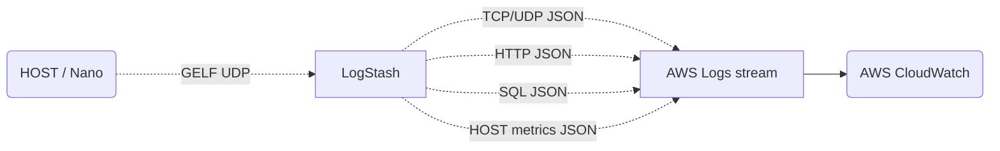

## How to integrate with AZURE Monitor?

Minotor lacks high-quality traffic logs, and consequently, it lacks fine-grained traffic monitoring capabilities and application performance monitoring capabilities.  Nano can easily and quickly address this shortcoming;

"Nano + AZURE Logs Analystics" can achieve non-intrusive monitoring of environments, hosts, and businesses, as well as cloud network performance management (NPMD), Web/HTTP/API performance monitoring, SQL performance monitoring, and other application scenarios. The schematic diagram of the method is as follows:

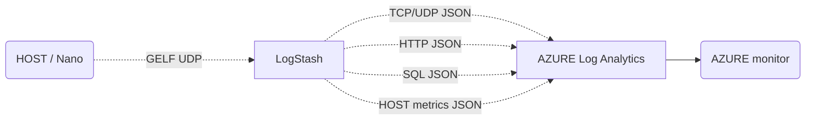

## How to adapt ELF/EFK?

The ELK/EFK solution includes the Packetbeat tool, which has similar functions to Nano. However, we believe that users can make a product that better meets their own needs by comparing the processing capabilities, deployment convenience, resource consumption, all-weather operation capability, and functional completeness of the two probes.

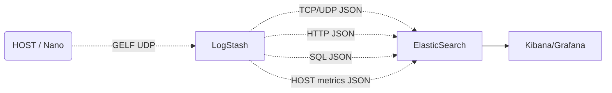

## How to adapt to Splunk?	

Splunk's solution includes a switch-based traffic analysis product that mirrors traditional solutions, but it lacks a host-based packet capture and analysis product. Therefore, in cloud and cloud-native environments, there are significant limitations in its solution.

Based on this, we recommend the solution of Splunk + Nano to achieve "cloud network performance management (NPMD) in an ultra-lightweight manner,

Web/HTTP/API performance monitoring, SQL performance monitoring, east-west risk monitoring, threat intelligence comparison, suspected mining hosts, incident traceback analysis, and other application scenarios.

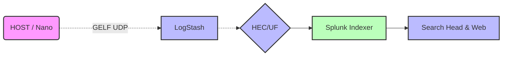

## How to adapt to Graylog?

The Graylog solution lacks the traffic analysis capabilities similar to ELK/EFK/Packetbeat, and therefore does not possess the functionality and scenarios required to achieve fine-grained traffic observability within cloud and cloud-native environments.  However, the combination of Graylog and Nano can perfectly address this shortcoming;

It can assist Graylog users in quickly implementing various application scenarios such as "cloud network performance management (NPMD), Web/HTTP/API performance monitoring, SQL performance monitoring, east-west risk monitoring, threat intelligence comparison, suspected mining hosts, incident traceback analysis, and more";

Especially, Nano has specifically designed relevant RESTful management functions for Graylog. For Graylog users, they only need to log in to Graylog-

On the Sidecar page, various management and configuration of Nano can be completed based on the Sidecar method.  Therefore, Graylog + Nano is very simple, as shown below:

## How to adapt to AWS OpenSearch?

The OpenSearch solution lacks fine-grained traffic log collection and analysis capabilities, and therefore does not possess the functionality and scenarios required to achieve fine-grained traffic observability within cloud and cloud-native environments.  However, the combination of OpenSearch and Nano can perfectly address this shortcoming;

It can assist OpenSearch users in swiftly implementing various application scenarios, including "cloud and network performance management (NPMD), Web/HTTP/API performance monitoring, SQL performance monitoring, east-west risk monitoring, threat intelligence comparison, suspected mining hosts, incident traceback analysis, and more";  the schematic diagram is as follows:

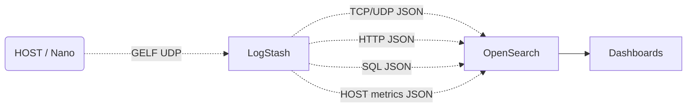

## How to adapt Wazuh?

The integration of Nano with Wazuh has established a closed-loop security capability that transforms "visibility" into "understanding" for fine-grained browsing metrics within the cloud.

Nano achieves fine-grained visibility by deeply collecting data such as network traffic, API calls, and identity authentication in the cloud environment, and comprehensively recording protocol content such as HTTP, SQL, and DNS.  Once the data is imported into Wazuh, with its rule engine and correlation analysis capabilities, it can detect threats in multiple dimensions, including web attacks, data breaches, injection attacks, and abnormal access, providing comprehensive technical support for cloud security operations.  The deployment method is as follows:

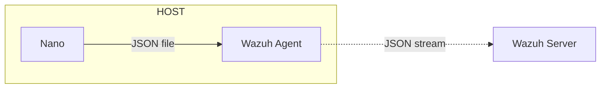

## How to adapt to IBM QRadar?

The integration of Nano with QRadar has established a closed-loop security capability that transforms the "visibility" of fine-grained browsing data within the cloud into "understanding" of it.

Nano provides fine-grained visibility by deeply collecting data such as network traffic, API calls, data queries, and identity authentication in the cloud environment, and comprehensively recording protocol content such as HTTP, SQL, and DNS.  After importing data into QRadar, with its rule engine and correlation analysis capabilities, it can significantly enhance QRadar's ability to detect risks within the cloud and analyze the context of various alerts. It is a beneficial supplement to the QRadar solution.  The deployment method is as follows:

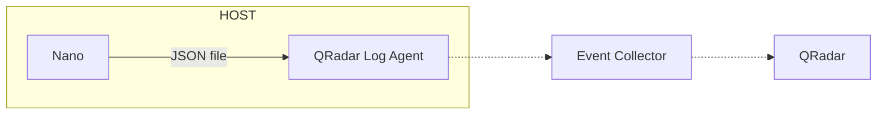

------

**www.microflow.io**

**microflow.io@gmail.com**

**07/23/2023**

